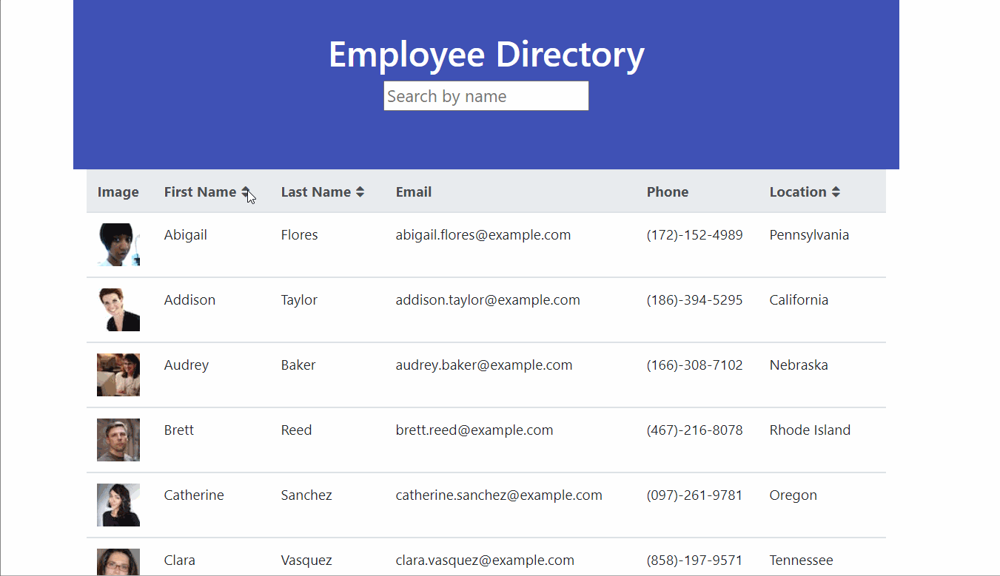

# Employee Directory

## Description
View public information such as name, email, phone number, and birthday of each employee at your company. You can also sort by name, or search by name.

## Table of Contents
* [Deployed Link](#deployed-link)
* [Installation](#installation)
* [Usage](#usage)
* [License](#license)
* [Author](#author)
* [Questions](#questions)
* [Acknowledgements](#acknowledgements)

## Deployed Link
[Deployed on GitHub Pages](https://haleynmyers.github.io/emp-directory/)

## Installation
If you wish to clone the code locally, you will need to run
`npx create-react-app` to install the a new instance of React. Then replace the given `src` folder with this one. `npm install` will install all needed dependencies in the package.json. 

## Usage
Used the deployed site provided above.
Or if cloning locally, run `npm start` after the dependencies have been installed.

## License

## Author
Haley Myers

## Questions
Please email [haleynmyers@gmail.com](mailto:haleynmyers@gmail.com)

